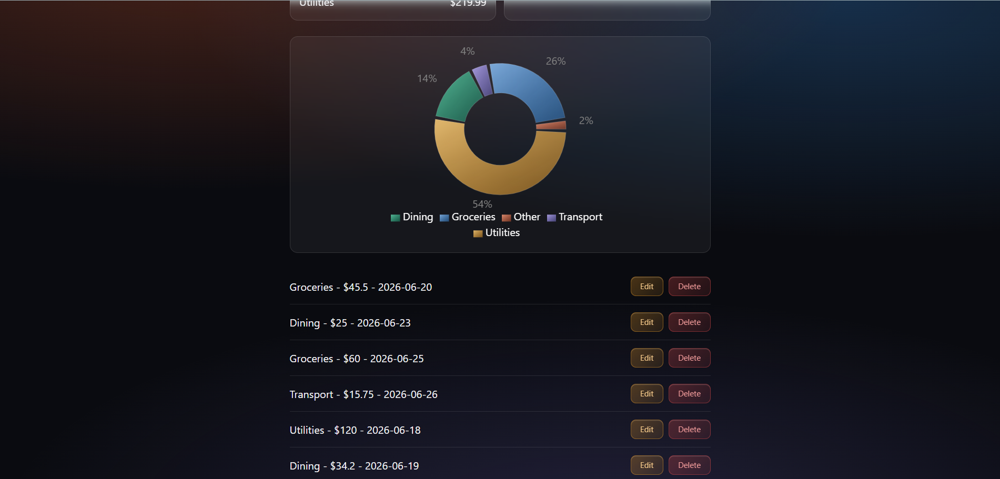

# Expense Tracker

A full-stack expense tracking web application with full CRUD, category and monthly spending summaries, and an interactive chart — built with a React frontend, a Spring Boot REST API, and a PostgreSQL database, deployed live across three cloud platforms.

**🔗 Live demo: [expense-tracker-ap4.netlify.app](https://expense-tracker-ap4.netlify.app)**

> Note: the backend runs on a free tier that sleeps after inactivity, so the first request may take ~30–50 seconds to wake up. After that it's fast.

---

## Screenshot



---

## Features

- **Full CRUD** — create, read, update, and delete expenses
- **Category summaries** — live totals grouped by category
- **Monthly summaries** — live totals grouped by month
- **Interactive chart** — a donut chart of spending by category (Recharts)
- **Live-updating UI** — summaries and chart refresh automatically after any change
- **Loading, empty, and error states** — handled gracefully throughout
- **Form validation** — prevents invalid submissions before they reach the API
- **Dark glassmorphism theme** — custom gradient and frosted-glass styling

---

## Tech Stack

**Frontend**
- React (Vite)
- Tailwind CSS
- Recharts

**Backend**
- Java 17 / Spring Boot
- Spring Data JPA
- REST API with custom JPQL aggregation queries

**Database**
- PostgreSQL

**Deployment**
- Frontend → Netlify
- Backend → Render (Docker)
- Database → Neon (managed PostgreSQL)

---

## Architecture

The backend follows a standard layered Spring Boot architecture:

```
Entity → Repository → Service → Controller
```

- **Entity** — maps to the `expenses` table; auto-sets the creation timestamp via a `@PrePersist` hook
- **Repository** — Spring Data JPA, plus custom `@Query` aggregations for the category and monthly totals
- **Service** — business logic, injected into the controller via constructor-based dependency injection
- **Controller** — exposes REST endpoints under `/api/expenses`

The project is a monorepo:

```
expense-tracker/
├── backend/    # Spring Boot API
└── frontend/   # React app
```

---

## API Endpoints

| Method | Endpoint                        | Description                  |
|--------|---------------------------------|------------------------------|
| GET    | `/api/expenses`                 | List all expenses            |
| GET    | `/api/expenses/{id}`            | Get a single expense         |
| POST   | `/api/expenses`                 | Create an expense            |
| PUT    | `/api/expenses/{id}`            | Update an expense            |
| DELETE | `/api/expenses/{id}`            | Delete an expense            |
| GET    | `/api/expenses/summary/category`| Totals grouped by category   |
| GET    | `/api/expenses/summary/month`   | Totals grouped by month      |

---

## Running Locally

### Prerequisites
- Java 17
- Maven
- Node.js 18+
- A local PostgreSQL instance

### 1. Database

Create a database and table:

```sql
CREATE DATABASE expense_tracker;

CREATE TABLE expenses (
    id SERIAL PRIMARY KEY,
    amount NUMERIC(10, 2) NOT NULL,
    category VARCHAR(50) NOT NULL,
    date DATE NOT NULL,
    description VARCHAR(255),
    created_at TIMESTAMP DEFAULT CURRENT_TIMESTAMP
);
```

### 2. Backend

The backend reads its database configuration from environment variables. Set these before running:

```
DB_URL=jdbc:postgresql://localhost:5432/expense_tracker
DB_USERNAME=postgres
DB_PASSWORD=your_password
```

Then, from the `backend/` folder:

```bash
./mvnw spring-boot:run
```

The API starts on `http://localhost:8080`.

### 3. Frontend

From the `frontend/` folder, create a `.env` file:

```
VITE_API_URL=http://localhost:8080
```

Then install and run:

```bash
npm install
npm run dev
```

The app starts on `http://localhost:5173`.

---

## Deployment Notes

- The backend is containerized with a multi-stage **Dockerfile** (JDK to build, JRE to run) and deployed on Render.
- Configuration (database credentials, API URL, allowed CORS origins) is fully externalized via environment variables, so the same code runs locally and in production.
- The frontend's API base URL is injected at build time via `VITE_API_URL`.

---

## What I'd Add Next

- User accounts and authentication
- Date-range filtering and search
- Budgets with alerts
- Editable categories

---

## Author

Built by Aryan as a full-stack portfolio project.
